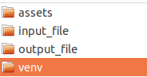
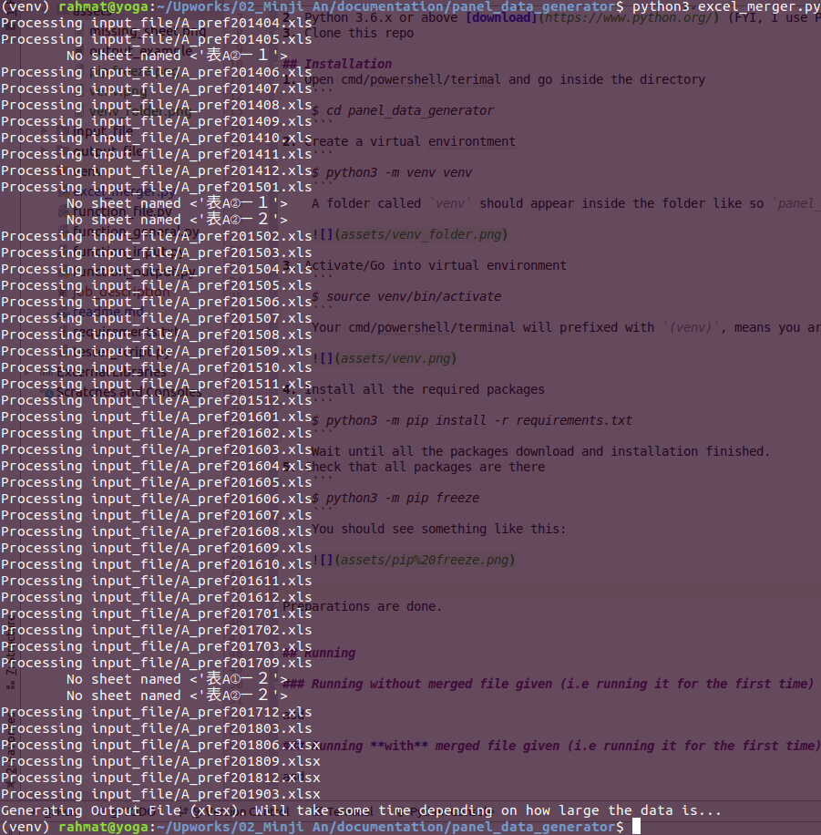
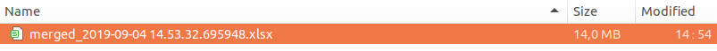
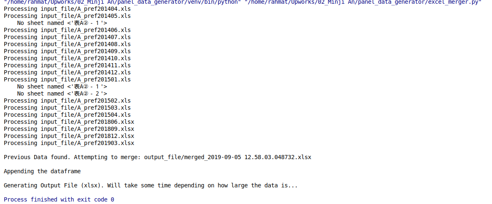

# panel_data_generator

Work in progress.

## Getting started and Requirements
1. OS of Windows 7/10, I strongly recommend a 64 bit copy
2. Python 3.6.x or above [download](https://www.python.org/) (FYI, I use Python 3.6.8)
3. Clone this repo

## Installation
1. Open cmd/powershell/terimal and go inside the directory
    ```
    $ cd panel_data_generator
    ```
2. Create a virtual environtment
    ```
    $ python3 -m venv venv
    ```
    A folder called `venv` should appear inside the folder like so `panel_data_generator/venv`
    
    

3. Activate/Go into virtual environment
    ```
    $ source venv/bin/activate
    ```
    Your cmd/powershell/terminal will prefixed with `(venv)`, means you are in virtual environment. Like so,
    
    
    
4. Install all the required packages
    ```
    $ python3 -m pip install -r requirements.txt
    ```
    Wait until all the packages download and installation finished.
5. Check that all packages are there
    ```
    $ python3 -m pip freeze
    ```
    You should see something like this:
    
    

    Preparations are done.

6. (Optional) For escaping the virtual environment (i.e. exit)
    ```
    $ deactivate
    ```
    The prefix `(venv)` should disappear, and you can close your console.


## Running

### A. Running without merged file given (i.e running it for the first time)
1. Place all your excels into `input_file` folder
    1. The filename can be anything, as long as it contains `A_prefYYYMM`, where `YYYY` is a 4 digit year and `MM` is 2 digit months (with trailing zero).
    The script will identify the pattern with regex and process it according to the year and month
    2. Make sure that each of the input file has the following sheets:
        1. `表A①－１`
        2. `表A①－２`
        3. `表A②－１`
        4. `表A②－２`
        
        Should any sheet is missing, the script will skip such particular 
2. Inside the `venv`, run the script like so
    ```
    $ python3 excel_merger.py
    ```
    
    The result will be something like this
    
    
    
    And the output will be in `output_file` folder like so
    
    


### B. Running **with** merged file given (i.e running it for the first time)

1. Make sure that the **Output File** you want to merge are inside the `output_file` folder with pattern of `merged_xxxx` where xxx is the timestamp (this is fully configurable, should you want to change it).
    
    Logic:
    1. It will list all the files in `output_file` that suffixed `.xls` or `.xlsx`
    2. For all the files, get the most latest by name (descending sort)
    3. Open the file, and append all the sheet back into pandas.DataFarme to be merged later
    
    At first, you will not have `merged_xxx.xlsx`. But after you run it for the first time, it will pop up as the result.

2. Do the step from the **point B**
3. The output console will indicate that it found previous **Output File**

    
    
    The result will be newly created **Output File** that merge the result before *plus* the data from `input_file` like so
    
    
    
    We can see that the first file is 5MB in size. 
    If we rerun the script, we will get around 10MB of file (5MB old data + 5MB newly created input data). 
    The next rerun, it will be around 15MB in size (10MB + 5MB), and so on.
    This is to prove that the data is merged successfully.
    


## Notes
**Note 1:** It may take some times to generate the excel files, assuming that it will have huge rows. 
For comparison, I have i7 and 16GB of RAM and generating 15MB worth of excel took me 30-45 seconds.


**Note 2:** I have done optimizing the code using panda's Dataframe and it run so fast for the data processing, but the time really takes when writing to the excel. So I believe this is as fast as we can go with `xlsxwriter` engine.
